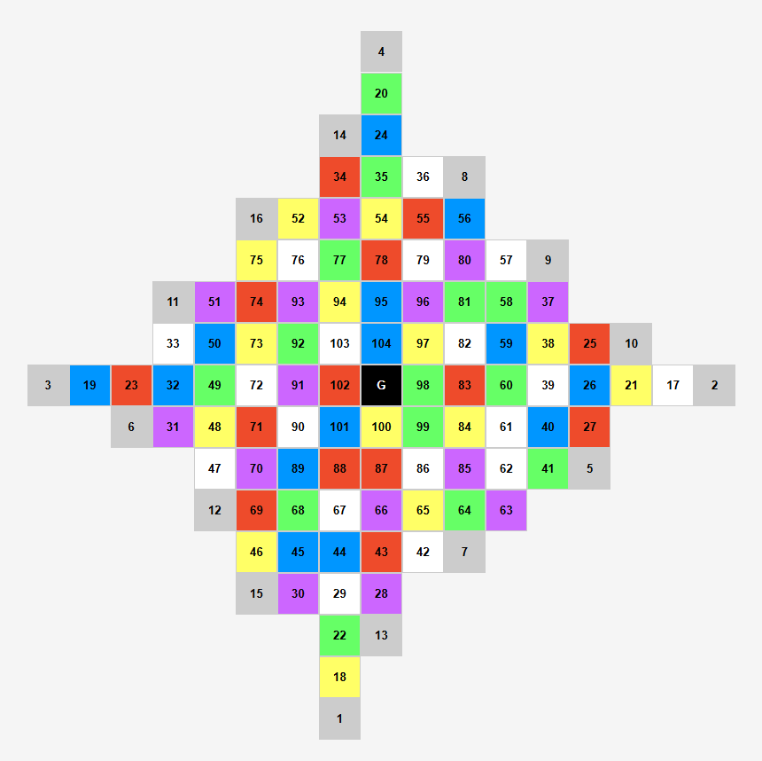

> 📙 中文說明接在英文之後。

# 🧩 UnKnown - Digital Board Game

A digital adaptation of the multiplayer strategy board game *UnKnown*, inspired by **The Devil's Plan 2**. This game supports both human and AI players, featuring dynamic cube movement and complex chain-rule interactions.

## 🖼️ Screenshot

---

## 🎮 Game Overview

Each player controls a colored six-faced cube, navigating across a 104-tile board. The goal is to reach the finish tile while using and responding to triggered rules to outmaneuver other players. Movement may trigger chained rules, leading to forced moves, color changes, or even banishment.

---

## 📜 Game Rules (8 Total)

1. **Banishment**: If your cube’s top face is white, or you land on a white tile → you are immediately banished.
2. **Penalty**: The first two players to accumulate 3 banishment tokens must each pay 3 "Piece" points.
3. **Push Exception**: Being pushed does not trigger rules, but may still cause banishment.
4. **Color Isolation**: If no tile (including your own) in your 3×3 area shares your top color → you must change your top color.
5. **Valid Color Selection**: You may only change your top color to a non-white, non-gray color that exists within your 3×3 area.
6. **Triple Match Trigger**: If 3 or more tiles in your 3×3 area (including yourself) match your top color → you must move another matching cube.
7. **Yellow Exception**: If your top color is yellow → you may choose **any** cube to move instead.
8. **Line Bonus Move**: If 3 tiles of the same top color form a straight line (including diagonals) → gain an extra move.

---

## ⚙️ Project Structure

- `game_flow_system.js`: Main game loop, turn system, and action queue
- `game_logic.js`: Cube rotation, rule logic, and board state handling
- `ai_module.js`: Basic AI decision logic (randomized or extendable)

---

## 🧠 Features

- ✅ Human and AI mixed play support
- ✅ Action queue system for chained rule processing
- ✅ Fully implemented 8-rule logic with recursion & priority handling
- ✅ Realistic cube face orientation and rotation handling
- ✅ Automatic rule detection and visual update

---

## 🚀 How to Run

### 1. Launch a Local Server
Use something like **VS Code Live Server**, or run via `python -m http.server` in your project folder.

### 2. Open `index.html`
Use any browser to access the game UI.

### 3. Start the Game
Follow the instructions to pick your starting location, top color, and cube facing. The game begins once all players are ready.

---

## ⚠️ Developer Notes

- Always use `player.id` to refer to a specific player (not array index).
- Rule 1 (banishment) must be evaluated **immediately after movement**.
- For Rule 4/5, your current tile color is used if you're standing on it (not your cube top).
- Use `createCube(top, facing)` and `rotateCube(...)` correctly — ensure configuration is defined in `cubeMap`.

---

## ✅ TODOs (Optional Features)

- [ ] Highlight rules that are about to be triggered
- [ ] Action history / playback system
- [ ] Smarter AI decision tree (based on risk/benefit)
- [ ] Visual animations / audio cues for rule triggers

---

# 🧩 UnKnown - 棋盤遊戲

這是一款改編自《魔鬼的計謀2》的多人對戰棋盤遊戲《UnKnown》的數位化版本，支援人類與 AI 玩家進行對戰，遊戲核心為策略性移動與連鎖規則觸發。

---

## 🎮 遊戲簡介

玩家將控制六面不同顏色的立方體，在 104 格的棋盤上前進，目標是透過規則策略前進至終點。  
每個行動都可能觸發連鎖規則，導致其他玩家被迫移動、換色或被放逐，戰局充滿變數。

---

## 🧠 遊戲規則（共 8 條）

1. **放逐**：頂面為白或停在白色格子 → 被放逐。
2. **放逐懲罰**：累積 3 枚放逐標記者 → 扣 3 枚皮斯。
3. **推動不連鎖**：被推動不會觸發規則，但仍可能被放逐。
4. **九宮格強制換色**：九宮格內（含自己）無其他與頂面同色 → 必須換色。
5. **換色條件**：新顏色必須存在於九宮格內（排除白與灰）。
6. **三枚同色移動**：若九宮格中同色達 3 枚（含自己）→ 強制指定一枚移動。
7. **黃色例外**：若頂面為黃色 → 可任意選擇任意一枚移動。
8. **三連直線加行動**：若同色直線達 3 → 可額外行動一次。

---

## ⚙️ 系統架構

- `game_flow_system.js`：主要控制遊戲流程與 action queue
- `game_logic.js`：棋盤邏輯、Cube 行為與規則觸發機制
- `ai_module.js`：AI 決策行為（隨機 / 可擴展為策略）

---

## 🧪 技術特色

- ✅ 支援真人與 AI 混合對戰
- ✅ 使用 action queue 處理連鎖觸發邏輯
- ✅ 精確實作 8 條遊戲規則，包含遞迴觸發與優先順序處理
- ✅ 自定義 Cube 顏色與朝向，模擬實體翻轉行為
- ✅ 自動檢查頂面 / 地板顏色觸發放逐邏輯

---

## 🚀 開發與執行方式

### ✅ 1. 啟動本地伺服器（例如使用 VS Code Live Server）
確保所有檔案已放入同一資料夾中（含 `index.html`、JS 檔案與 CSS）

### ✅ 2. 開啟 `index.html`
可透過瀏覽器或 Live Server 開啟。

### ✅ 3. 遊戲開始
依畫面指示選擇初始位置與方塊頂面、朝向後進行遊戲。

---

## 👨‍💻 開發注意事項

- 使用 `player.id` 判斷玩家，而**非 array index**
- Rule 1 放逐邏輯需優先處理 → 移動後立刻判斷
- 九宮格顏色邏輯需區分：若自己站上該格 → 使用**格子顏色**而非方塊頂面
- 頂面顏色與朝向搭配必須在 `cubeMap` 中為合法組合

---

## 📁 待辦事項（可選）

- [ ] 視覺提示：目前可觸發的規則高亮
- [ ] 記錄行動歷史 / 重播
- [ ] 更智能的 AI 決策（根據勝率/風險）
- [ ] 觸發規則動畫與音效提示

